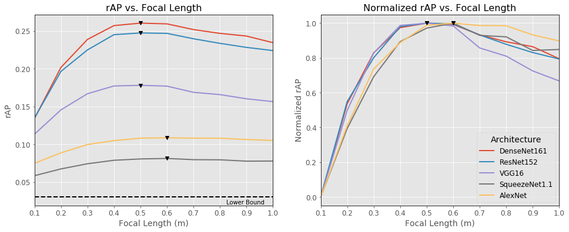
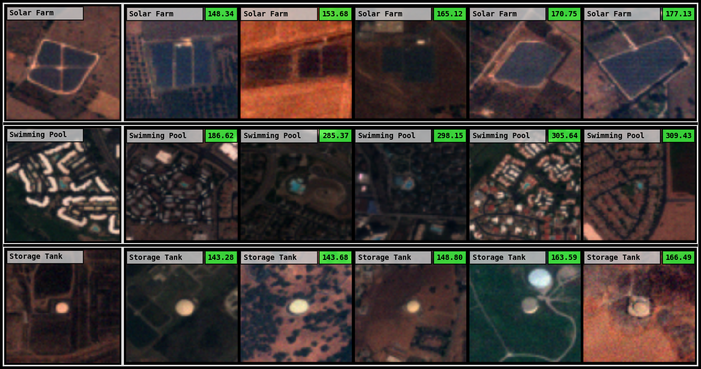

# SepSense
**Remote Sensor Design for Visual Recognition with Convolutional Neural Networks**
While deep learning technologies for computer vision have developed rapidly since 2012, modeling of remote sensing systems has remained focused around human vision. In particular, remote sensing systems are usually constructed to optimize sensing cost-quality trade-offs with respect to human image interpretability. While some recent studies have explored remote sensing system design as a function of simple computer vision algorithm performance, there has been little work relating this design to the state-of-the-art in computer vision: deep learning with convolutional neural networks. We develop experimental systems to conduct this analysis, showing results with modern deep learning algorithms and recent overhead image data. Our results are compared to standard image quality measurements based on human visual perception, and we conclude not only that machine and human interpretability differ significantly, but that computer vision performance is largely self-consistent across a range of disparate conditions.

This repository contains all the code required to replicate the results of our research paper, and the corresponding docker environment in which that code can be executed. All code is written in Python3 and utilizes the PyTorch library (v1.0) for neural network model training and evaluation. Jupyter notebooks are used to visualize images transformed with our code, in addition to plotting experimental results. We also include the specific parameter files used to execute our experiments, with the intent that these experiments can be replicated.

## Capabilities
This code has the ability to reproduce the experiments from our research paper, and many of our visualizations.

### Conduct Experiments
The core purpose of the code is to measure how different sensor design configurations will affect recognition performance on the imagery these sensors will produce. For example, how will the imagery of a satellite sensor in orbit at 100km compare to that of one with an orbit at 500km? We mainly observe the effect of two optical parameters: focal length and aperture diameter. However, the system implemented in this code can explore many different factors which will affect image quality and recognition performance:
- Modify sensor parameters
- Modify image pre-processing methods
- Use different CNN architectures
- Solve different recognition problems
    - Classification
    - Retrieval
- Use different machine learning objectives
    - Cross-Entropy Loss
    - Triplet Margin Loss

### Analyze Results

#### Show Transformations
In REPO_ROOT/work/notebooks/transform.ipynb, sensor model imagery can be simulated for any image in the fMoW dataset. The sensor model parameters can be reconfigured as desired. In the figure below, a race track image is plotted using our "baseline" parameter configuration, with the focal length varied. The original image is shown on the right.


#### Plot Results
In REPO_ROOT/work/notebooks/plot.ipynb, experimental results can be plotted and compared. In the plots below, average precision is plotted as a function of focal length for five different CNN architectures. The plot on the right shows that the curves are very similar when normalized.


#### Visualize Retrieval
In REPO_ROOT/work/notebooks/retrieve.ipynb, the retrieval problem is visualized. Each row of images represents a
single retrieval query. Probe images are shown on the left of each row. Gallery images are ranked by least to greatest Euclidean
distance, left to right, from the probe. The Euclidean distance value between a gallery image and its corresponding probe is shown in the upper right of each gallery image. This distance value is colored green if the gallery image class matches its probe image class, and red if its does not.


## Run Instructions
This section contains the instructions required to replicate our research results, and conduct new experiments.

### Setup Environment
The code in this repository is meant to run inside a docker environment. A Dockerfile is included in the REPO_ROOT/docker directory which contains an environment sufficient to run all included code. This Dockerfile is based on the official nvidia/cuda image with Ubuntu 18.04 and CUDA 10.

To build the docker image:
```
host:REPO_ROOT$ cd docker && ./build.sh
```
### Download Data
This code is centered around the [Functional Map of the World (fMoW) Dataset](https://github.com/fMoW/dataset). The pre-processing and partitioning scripts assume that this dataset is being used, but most of the code is general, and can be adapted to other datasets.

Instructions for downloading the fMoW dataset are included in the [corresponding repo](https://github.com/fMoW/dataset). You will need to download the train and val partitions of the "fMoW-full" dataset. This data contains the 4 and 8-band multispectral tiff files needed in this code.

After downloading the data, the volume mounts in your docker container run script should be edited to put the dataset in a specific location:
```
 -v /PATH/TO/FMOW/DATA:/data/fmow/full \
```

### Run Docker Container
To execute the included Python scripts, start a docker container based on the built image. The REPO_ROOT/dev.sh script provides a template for a docker run script. You may also use [Kubernetes](https://kubernetes.io/), or another container orchestration system.

### Pre-Process Data
To create a partition of the data usable by this code, execute the following within the docker container:
```
container:/home/username/work# ./prep.py
```
This partition will be saved to REPO_ROOT/work/partition/ms/train_items_35_1x10-fold.json by default.

### Run Experiment

#### Configure Parameters
First, a YAML parameter file needs to be created. Check out REPO_ROOT/work/params/baseline.yaml for an example. The parameter file divides parameters into logical groupings. For example, there are parameter groupings corresponding to the data, the CNN model, and the sensor simulation model. The data.partition_dir parameter will be configured to match the one output from the data pre-processing step.

#### Start Trial
To launch a trial with a given parameter file, check out the REPO_ROOT/work/run.sh script. This script will run the given trial (second parameter) on the specified GPU devices (first parameter). Example usage for the baseline.yaml file:
```
container:/home/username/work# ./run.sh 0,1 baseline
```

### View Results
To plot experimental results, check out REPO_ROOT/work/notebooks/plot.ipynb for examples. The code to plot and parse results from all different experiment types is contained in REPO_ROOT/work/notebooks/analysis.py.

## Release
LLNL-CODE-773412
